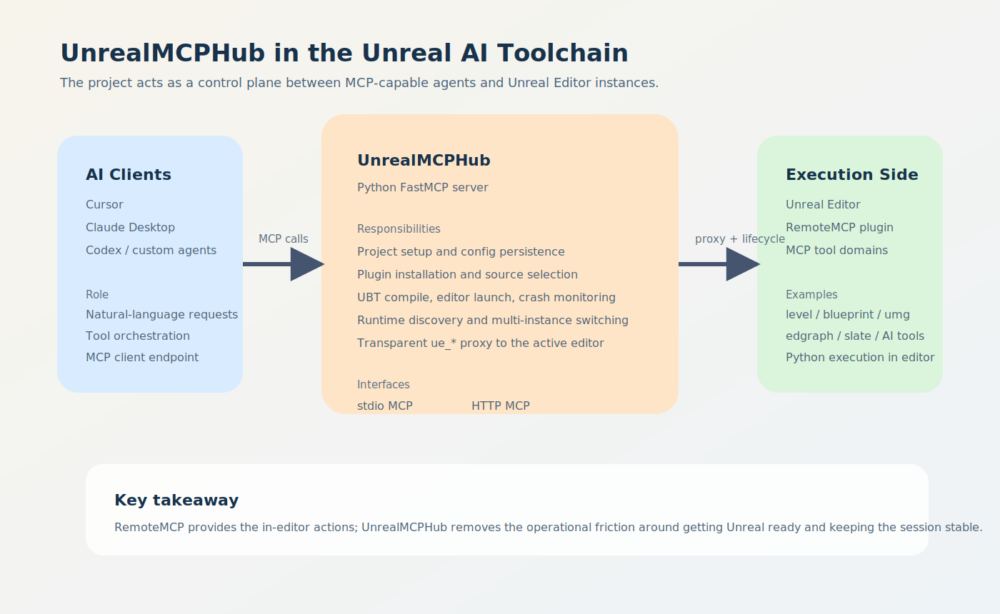
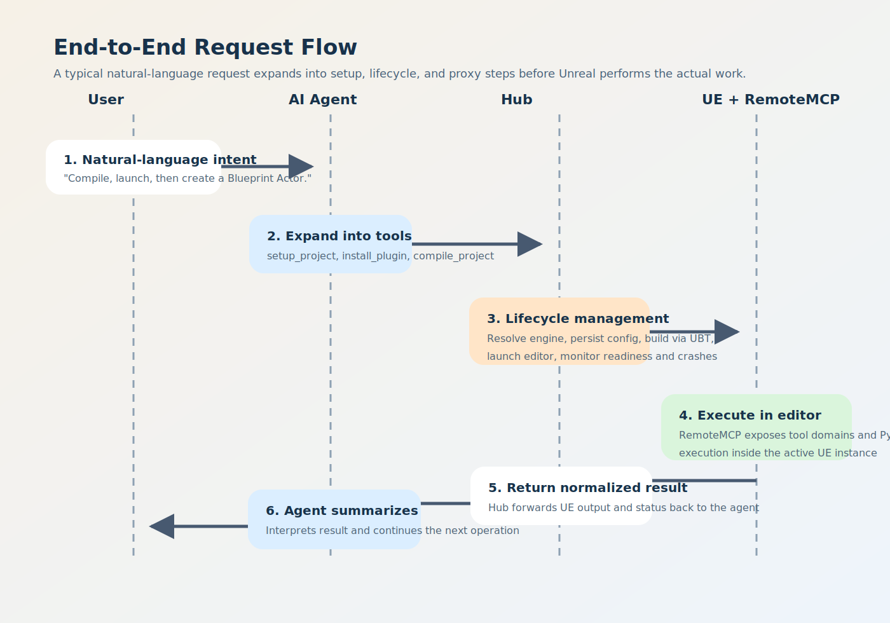
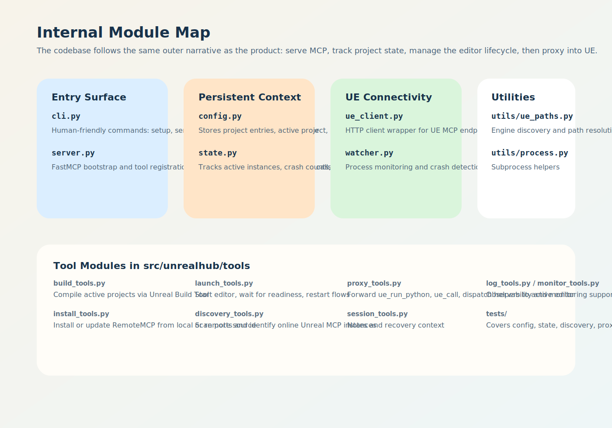

# UnrealMCPHub 项目分析

## TL;DR

`UnrealMCPHub` 并不是直接在 Unreal 里执行编辑动作的那一层，它更像是让 AI 驱动 Unreal 工作流真正可落地的“控制中枢”。

它位于支持 MCP 的 AI 客户端与 Unreal Editor 实例之间，负责处理最容易让自动化失效的那部分工作，包括：项目配置、插件安装、编译与启动编排、实例发现、崩溃恢复，以及将请求转发给运行在编辑器内部的 `RemoteMCP` 插件。

### 三个核心结论

- 真正提供编辑器内能力的是 `UnrealRemoteMCP`，而 `UnrealMCPHub` 的价值在于让这些能力对 AI 来说“可连接、可维护、可恢复”。
- 这个项目更适合被理解为“生命周期管理器 + UE 代理层”，而不是一个单独的 Unreal 插件。
- 从仓库信号来看，它已经更像一个持续维护中的 Beta 工具，而不是一次性的概念验证：有版本发布、PyPI 包装、CI、Release 流程和较完整的自动化测试。

## 1. 项目定位

### 它是什么

这个仓库打包了一个名为 `unrealhub` 的 Python 应用，同时提供两种入口：

- 面向人的 CLI
- 面向 AI 的 FastMCP Server

它的核心作用，是把“自然语言请求”到“Unreal 中实际执行”的整条路径统一起来。

### 它解决了什么问题

如果没有 Hub 这一层，AI 客户端通常需要自己处理下面这些问题：

- `.uproject` 文件在哪里
- 当前项目应该使用哪个 Unreal Engine 安装目录
- 所需插件是否已经安装
- 编辑器是否已经启动
- 当前可用的 MCP 端口是哪一个
- Unreal 崩溃之后怎么恢复

`UnrealMCPHub` 把这些状态和流程集中到一个 MCP 入口里，让 AI 只需要连一个稳定端点即可。

## 2. 生态关系

整个系统可以清楚地分成三层：

| 层级 | 主要组件 | 职责 |
|---|---|---|
| AI 客户端层 | Cursor、Claude Desktop、Codex、自定义 MCP 客户端 | 接收用户意图并编排工具调用 |
| 控制层 | UnrealMCPHub | 配置项目、启动与监控编辑器、转发请求 |
| 执行层 | Unreal Editor + RemoteMCP | 提供并执行真正的 Unreal 侧工具能力 |

最关键的边界在于：

- `RemoteMCP` 运行在 Unreal Editor 内部，暴露 `level`、`blueprint`、`umg` 以及 Python 执行等能力。
- `UnrealMCPHub` 运行在编辑器外部，负责保证这些能力“能够被接入、能够被维持、能够在异常后恢复”。

## 3. 一次完整请求是怎样流转的

理解这个仓库最直接的方式，是看一个完整用户故事：

> “帮我编译项目、启动 Unreal，然后创建一个 Blueprint Actor。”

这句话在系统内部通常会展开成下面的过程：

1. AI 客户端先调用 Hub 侧工具，例如 `setup_project`、`install_plugin`、`compile_project`、`launch_editor`。
2. Hub 负责解析引擎路径、持久化项目配置、调用 Unreal Build Tool、启动编辑器，并等待 MCP 服务就绪。
3. 当 Unreal 编辑器上线后，AI 再切换到 `ue_*` 这一类工具，例如 `ue_get_dispatch`、`ue_call_dispatch`、`ue_run_python`。
4. Hub 将这些请求转发给当前激活的 Unreal 实例中的 `RemoteMCP`，再把结果整理后返回给 AI。

这正是 Hub 的核心价值所在：它把一条脆弱的多步骤运维链路，压缩成了一个可被 AI 稳定调用的 MCP 表面。

## 4. 仓库内部结构

代码结构和产品结构基本是一一对应的。

### 入口层

- `src/unrealhub/cli.py`
  - 面向人的命令入口，例如 `setup`、`serve`、`compile`、`launch`、`discover`、`monitor`
- `src/unrealhub/server.py`
  - FastMCP 服务的启动点
  - 注册 `setup_project`、`hub_status` 以及 `ue_*` 代理工具

### 持久化上下文

- `src/unrealhub/config.py`
  - 保存项目配置、活动项目、插件来源、扫描端口等信息
- `src/unrealhub/state.py`
  - 维护运行中的实例、活动编辑器、崩溃计数、会话笔记和调用历史

### 运行时集成

- `src/unrealhub/ue_client.py`
  - 与 Unreal 侧 MCP 端点通信
- `src/unrealhub/watcher.py`
  - 负责进程监听与崩溃检测

### 工具模块

`src/unrealhub/tools/` 是这个项目最核心的执行区：

- `build_tools.py`：编译流程
- `install_tools.py`：插件安装和来源管理
- `launch_tools.py`：编辑器启动与重启逻辑
- `discovery_tools.py`：端口探测与实例发现
- `proxy_tools.py`：`ue_run_python`、`ue_call` 及分发代理
- `session_tools.py`：会话笔记与恢复上下文
- `log_tools.py`、`monitor_tools.py`：监控与可观测性

## 5. 能力分层

从工具设计上看，这个项目天然分成两组能力。

### Hub 管理工具

这一组即使在 Unreal 没有启动时也能工作：

- `setup_project`
- `get_project_config`
- `hub_status`
- `compile_project`
- `launch_editor`
- `restart_editor`
- `install_plugin`
- `discover_instances`
- `use_editor`
- `get_crash_report`
- 会话笔记相关工具

它们让 Hub 成为一个“生命周期管理器”。

### UE 代理工具

这一组必须依赖一个在线的 Unreal 实例：

- `ue_run_python`
- `ue_call`
- `ue_list_tools`
- `ue_get_dispatch`
- `ue_call_dispatch`
- `ue_test_state`
- `ue_status`

它们让 Hub 成为一个“透明转发层”。

把这两类能力放在一起看，这个项目实际上同时解决了两个问题：

- 如何把 Unreal 拉起来并保持可用
- Unreal 可用之后，如何把能力稳定暴露给 AI

## 6. 工程成熟度

从仓库信号上看，它已经具备了一个“正在维护中的 Beta 项目”的基本特征。

| 信号 | 证据 |
|---|---|
| 版本化发布 | `pyproject.toml` 中包名为 `unrealhub`，当前版本为 `0.2.4` |
| 多种安装方式 | README 提供了 `uv`、`pip`、`uvx` 以及独立可执行文件方案 |
| CI 与发布自动化 | 存在 `.github/workflows/ci.yml` 与 `.github/workflows/release.yml` |
| 测试覆盖范围较广 | `tests/` 涵盖 config、state、discovery、proxy、install、server、watcher、process、path 等模块 |
| 版本演进清晰 | Git tag 从 `v0.1.0` 一直到 `v0.2.4` |

当然，它在包元数据里仍然标注为 Beta，所以更准确的理解应当是：“已经可用、而且在持续完善”，而不是“完全稳定的成熟平台”。

## 7. 优势、边界与风险

### 优势

- 将生命周期管理与编辑器执行能力清晰分层
- 很适合 AI 原生工作流，尤其是把自然语言自动拆解为多步 Unreal 操作
- 具备较实用的运维补强能力，例如崩溃恢复、多实例切换、会话笔记持久化
- 提供多种安装与运行形态，接入门槛相对低

### 边界

- Hub 本身并不替代 `RemoteMCP`，真正的 Unreal 操作仍依赖后者
- 项目价值建立在“客户端已经支持 MCP”这一前提上
- 某些流程仍然带有较强的 Unreal/Windows 环境假设，尤其是引擎发现与构建路径部分

### 风险与注意点

- 实际稳定性依然依赖于 `RemoteMCP` 侧是否健康、是否兼容
- 尽管包声明支持多平台，但 Unreal 生命周期相关行为仍需要按实际环境验证
- 当前架构更偏本地便利性；如果未来用于团队化或远程共享场景，HTTP 模式下的鉴权、观测和部署方式可能还需要继续补强

## 8. 采用建议

### 适合的场景

- 使用 Cursor、Claude、Codex 或其他 MCP 客户端的个人 Unreal 开发者
- 想尝试 AI 辅助 Unreal 内容生产或工具开发的小团队
- 因为 Unreal 启动、连接、恢复成本较高，希望把这些步骤交给 AI 自动处理的工作流

### 不太适合的场景

- 只能聊天、不能调用 MCP Server 的客户端
- 希望 AI 直接连 Unreal，而不想引入中间控制层的方案
- 期待仅凭 Hub 就获得全部 Unreal 编辑能力，而不搭配 `RemoteMCP` 的使用方式

## 9. 最终判断

`UnrealMCPHub` 最适合被看作一个“面向 AI 的 Unreal 编排层”。

它最重要的贡献，并不是新增了某种 Unreal 编辑能力，而是把 Unreal 自动化中最麻烦、最容易出错的那部分运维链路吸收掉了。这对于 Agent 工作流尤其重要，因为 AI 只需要记住一个稳定 MCP 入口，而项目配置、引擎发现、编译、启动、监控和转发这些复杂细节，都由 Hub 来承担。

如果有人问“这个仓库本身是不是已经足够独立有价值”，更准确的回答是：

- 单独看，它并不完整
- 但作为 `UnrealRemoteMCP` 的控制中枢，它非常有意思

真正的产品，其实是这两者的组合。
