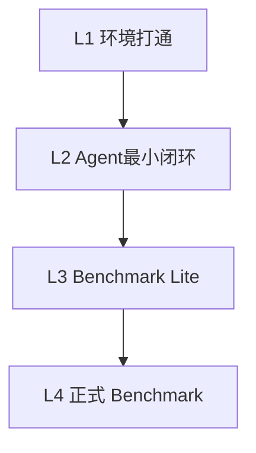

# Unreal Benchmark 研究试错报告

## 目标

本文档用于回答两个问题：

1. 为了最终跑通 UnrealMCPHub 的 `ue-benchmark`，还需要完成哪些步骤。
2. 结合当前测试环境，应该如何组织研究与试错流程，避免重复踩坑。

适用范围：
- 当前仓库的 [use-unrealhub](C:\Users\alain\Documents\Playground\UnrealMCPHub\skills\use-unrealhub\SKILL.md)
- 当前仓库的 [ue-benchmark](C:\Users\alain\Documents\Playground\UnrealMCPHub\skills\ue-benchmark\SKILL.md)
- 当前 benchmark 场景 [vampire-survivors-v1.md](C:\Users\alain\Documents\Playground\UnrealMCPHub\skills\ue-benchmark\scenarios\vampire-survivors-v1.md)

## 一句话结论

当前环境已经完成了“基础设施打通”，但还没有进入“正式 benchmark 执行”。

更准确地说，当前已经跑通的是：
- Hub 与 RemoteMCP 的安装和连接验证
- Unreal 侧插件编译与运行
- UE MCP 工具可调用

当前还没有跑通的是：
- 通过一个真实 AI 客户端稳定执行完整任务
- 在全新 UE C++ 工程中按 benchmark 要求完成游戏原型
- 完整执行 Cook/Package/Playability/Scoring

所以现在的状态适合进入“Benchmark Readiness”阶段，而不是直接宣称 benchmark 已完成。

## 当前已完成项

### 环境与工具链

- 已安装 `UnrealMCPHub`
- 已安装 `RemoteMCP` 到测试工程
- 已补齐 Visual Studio 2022 Build Tools
- 已补齐 `.NET Framework 4.8 SDK`
- 已让 Unreal 工程成功编译插件
- 已确认 UE 内 `RemoteMCP Running`

### UE MCP 通路验证

- 已验证 `8422` 端口监听
- 已验证 `/mcp` 端点可响应 MCP 初始化请求
- 已验证可列出 UE 工具
- 已验证可调用 `get_unreal_state`

### Hub 层状态

- 打包版 `unrealhub.exe` 的 `discover` 在当前环境下存在兼容问题
- 源码版 wrapper 可正常发现在线实例

这意味着：
- UE 侧链路已通
- Hub 源码版链路可用
- benchmark 的 blocker 已从“装不起来”转变成“流程还没规范跑完”

## Benchmark 的正式目标是什么

根据 [ue-benchmark](C:\Users\alain\Documents\Playground\UnrealMCPHub\skills\ue-benchmark\SKILL.md) 和场景文件 [vampire-survivors-v1.md](C:\Users\alain\Documents\Playground\UnrealMCPHub\skills\ue-benchmark\scenarios\vampire-survivors-v1.md)，这不是单纯的 MCP 联通测试，而是一个完整的端到端评测。

最终要达成的是：

1. 让 AI 在 Unreal 中独立完成一个完整原型。
2. 原型必须符合场景要求。
3. 工程必须可 Cook、可打包、可运行、可游玩。
4. 最后还要按评分体系完成验收。

这四层缺一不可。

## 最终跑通 benchmark 的必要步骤

下面这 8 步，是我认为最合理的正式路径。

### Step 1：固定基线环境

目标：
- 明确“哪套连接方式”是 benchmark 的官方执行路径

建议固定为：
- UE 5.7+
- Visual Studio 2022 Build Tools
- `RemoteMCP` 在线
- 优先使用源码版 Hub wrapper，避免被打包版 `discover` 问题干扰

产出：
- 一份固定 MCP 配置
- 一份固定 Unreal 项目初始化方式

### Step 2：确认 benchmark 使用的 AI 客户端

当前还缺少这一层的正式闭环。

必须确定：
- 用哪个 AI 客户端接 MCP
- 客户端是否稳定支持 `streamable-http` 或 `stdio`
- 是否能稳定列出工具和执行多步任务

如果这一步不先定下来，后续很容易把“客户端问题”误判成“benchmark 失败”。

最低通过标准：
- 能连接到 UE MCP
- 能读状态
- 能调用 1 个只读工具
- 能调用 1 个写工具
- 能返回结构化结果

### Step 3：做 Benchmark Lite

不要一开始就执行完整 `vampire-survivors-v1`。

先做一个轻量版内部 benchmark，验证 agent 是否具备连续执行能力。

建议最少包含 3 个任务：
- 读取当前 Unreal 工程状态并总结
- 在 sandbox 地图创建一个测试 Actor
- 启动 PIE 并验证对象存在

最低通过标准：
- 三个任务都能完成
- 中间不需要人工救火
- 能输出变更摘要和验证结果

### Step 4：建立正式 benchmark 工程基线

根据场景文件，正式 benchmark 假设起点是：
- 全新空白 UE C++ 工程

这一步需要标准化：
- 工程创建方式
- 目录结构
- `Build.cs` 初始依赖
- 插件启用策略
- 打包目标平台

如果每次 benchmark 起点不同，结果不可比。

### Step 5：按场景阶段执行

`vampire-survivors-v1` 已经把过程拆成 Phase 0 到 Phase 8。

最重要的是不要把它当一条 prompt 就结束，而要把执行过程记录为阶段性里程碑：

- Phase 0：工程初始化
- Phase 1：核心 3C
- Phase 2：战斗系统
- Phase 3：游戏循环
- Phase 4：关卡与环境
- Phase 5：音效
- Phase 6：集成与 PIE 测试
- Phase 7：可选增强
- Phase 8：Cook & Package

建议每个 Phase 都保留：
- 输入任务
- 工具调用摘要
- 关键产物
- 编译状态
- 已知问题

### Step 6：执行 PackageGate

这是 benchmark 最关键的一步。

根据 benchmark 规则：
- Cook 失败，整体记零分
- 打包后不能启动，整体记零分
- 打包后不能正常进入游戏或短时间崩溃，整体记零分

所以“能在编辑器里跑”不算 benchmark 通过。

正式通过标准至少包括：
- `RunUAT BuildCookRun` 成功
- 打包产物能启动
- 能进入游戏
- 能控制角色
- 能遇到敌人

### Step 7：执行可玩性验证

场景文件里已经给了结构化检查清单。

不能只靠一句“玩起来差不多”。

至少要做：
- 输入响应验证
- 战斗反馈验证
- 游戏循环验证
- UI 与信息验证

建议把每个验证项记录成：
- 通过 / 失败
- 备注
- 截图或日志证据

### Step 8：正式评分与归档

最终分数由：
- `PackageGate`
- `UserScore`
- `AIReviewScore`
- `ContentScore`
- `TokenScore`

共同组成。

要把 benchmark 跑成可复用成果，最后必须保存：
- 项目目录
- 打包产物
- 任务日志
- token 记录
- 验证清单
- 最终分数

## 推荐的研究试错流程

为了避免直接把失败都算在 benchmark 头上，我建议把研究流程拆成四层。

### L1 环境打通

目标：
- 证明 UE、RemoteMCP、Hub、客户端之间真的能通信

成功标准：
- 连接成功
- 工具可列出
- 最小读写调用成功

你们现在基本已经完成这一层。

### L2 Agent 最小闭环

目标：
- 证明客户端里的 AI 能连续完成一个最小任务闭环

成功标准：
- 读状态
- 写一个小改动
- 运行一次验证
- 输出总结

这一层是当前最适合马上进入的阶段。

### L3 Benchmark Lite

目标：
- 用缩小版 benchmark 先测试持续执行能力

建议任务：
- 建一个简单 C++ Actor
- 放到测试地图
- 跑 PIE
- 验证日志和存在性

成功标准：
- 一次任务链可以独立完成
- 不需要频繁手工兜底

### L4 正式 Benchmark

目标：
- 按场景要求跑完整 benchmark

只有当前三层稳定后再做，结果才有参考价值。

## 当前已知卡点与风险

### 1. 打包版 Hub discover 兼容性

现象：
- 打包版 `unrealhub.exe discover` 在当前环境下不稳定

影响：
- 可能干扰正式 benchmark 的实例发现环节

建议：
- 短期以源码版 wrapper 作为执行基线
- 长期再决定是否修 Hub 打包版

### 2. Benchmark 不是“插件联通测试”

现象：
- 当前最容易误判的一点，是把“RemoteMCP 跑起来了”当成 benchmark 已可跑

实际情况：
- 这只完成了基础设施验证
- 距离正式 benchmark 还有客户端、任务执行、打包、评分几层

### 3. 场景要求偏重

`vampire-survivors-v1` 要求：
- 全部逻辑使用 C++
- 完整 3C
- 完整战斗
- 完整循环
- 可打包可游玩

这已经不是 smoke test，而是一个高强度综合 benchmark。

建议：
- 先做 Lite 版
- 再做正式版

### 4. Unreal 二进制资产审计难

即使 benchmark 主要强调 C++，关卡、UI、资源和打包过程里仍然有大量二进制资产。

建议：
- 每个阶段记录资产清单
- 记录关键日志
- 记录验证结果
- 不要只依赖 Git diff

## 研究试错建议顺序

我建议接下来按这个顺序推进。

### 阶段 A：固定执行基线

- 选定 AI 客户端
- 选定 MCP 连接方式
- 固定 benchmark 起始工程模板
- 固定日志记录方式

### 阶段 B：完成最小 agent 闭环

- 读状态
- 创建最小 C++ 内容
- 编译
- PIE
- 总结

### 阶段 C：完成 Benchmark Lite

- 做一个小型端到端任务
- 保留任务日志
- 记录失败点
- 修 workflow 与 rules

### 阶段 D：执行正式 benchmark

- 按 `vampire-survivors-v1` 全流程跑
- 保留每阶段产物和记录
- 最终做 PackageGate 和评分

## 建议产出物

为了让后续研究可复现，我建议每次正式试错都保留这些产物：

- benchmark 配置
- AI 客户端配置
- MCP 连接方式
- Unreal 工程路径
- 每阶段日志
- 编译日志
- Cook/Package 日志
- 可玩性验证清单
- 失败原因与修复记录
- 最终得分

## 对你当前阶段的建议

如果目标是“尽快真正开始 benchmark”，最适合的下一步不是直接跑完整 `vampire-survivors-v1`，而是：

1. 先选定一个真实 AI 客户端作为基线。
2. 先跑一个 Benchmark Lite。
3. 把 Lite 过程中所有失败点记成正式试错记录。
4. 再进入完整 benchmark。

这样能把“环境问题”“agent 问题”“场景太重”这三类因素拆开，不会把一次失败混成一个模糊结论。

## 下一步建议

推荐优先级如下：

1. 固定客户端与 MCP 配置
2. 设计 Benchmark Lite 任务
3. 跑第一轮 Lite 并记录全过程
4. 基于记录更新 workflow、rules、todo
5. 再启动正式 benchmark

---

如果继续推进，我建议下一份文档直接写成：
- `benchmark-lite-plan.zh-CN.md`

它专门定义第一轮最小 benchmark 的任务、通过标准、记录模板和失败分类。
