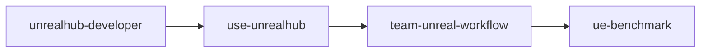

# Unreal AI Skill System

## Purpose

This document defines a practical skill stack for using AI in an Unreal game project built around UnrealMCPHub. It translates the repository's built-in skills into a team workflow that is safer for production-oriented development.

## Layering

Use the skills as a layered system instead of as parallel options:



- `unrealhub-developer`
  Maintain the Hub codebase itself. Use only when changing `src/unrealhub/*`, adding tools, or modifying Hub behavior.
- `use-unrealhub`
  Operate Unreal through the Hub or RemoteMCP. This is the default runtime skill for project work.
- `team-unreal-workflow`
  Project-specific wrapper knowledge. This is the layer the team should customize with workflow, safety rules, and task templates.
- `ue-benchmark`
  Evaluate agents after the runtime workflow is stable. Do not use it as the starting point for day-to-day project setup.

## Recommended Team Skill Stack

### 1. Base Runtime Skill

Source skill:
- [use-unrealhub](C:\Users\alain\Documents\Playground\UnrealMCPHub\skills\use-unrealhub\SKILL.md)

Responsibility:
- project setup
- compile and launch
- instance discovery
- UE tool proxying
- crash recovery
- Unreal-specific operational patterns

Use for:
- opening and building the project
- running Unreal-side tools
- working with levels, blueprints, UMG, Slate, PIE, and logs

### 2. Team Workflow Skill

This should be your own project-facing wrapper skill. It does not replace `use-unrealhub`; it narrows and structures it.

Responsibility:
- define what AI is allowed to touch
- define default task sequence
- define sandbox locations
- define reporting and review requirements
- define task templates that match the project's architecture

Recommended inputs:
- [workflow.md](C:\Users\alain\Documents\Playground\UnrealMCPHub\docs\unreal-ai-playbook\workflow.md)
- [rules.md](C:\Users\alain\Documents\Playground\UnrealMCPHub\docs\unreal-ai-playbook\rules.md)
- [todo.md](C:\Users\alain\Documents\Playground\UnrealMCPHub\docs\unreal-ai-playbook\todo.md)

### 3. Benchmark Skill

Source skill:
- [ue-benchmark](C:\Users\alain\Documents\Playground\UnrealMCPHub\skills\ue-benchmark\SKILL.md)

Responsibility:
- evaluate a fully autonomous or semi-autonomous agent run
- score implementation quality and playability
- compare agents or workflows over time

Use for:
- milestone evaluation
- internal bake-offs
- regression checks after changing the workflow

Do not use for:
- first-time installation
- daily prototyping
- safety policy definition

### 4. Hub Maintenance Skill

Source skill:
- [unrealhub-developer](C:\Users\alain\Documents\Playground\UnrealMCPHub\skills\unrealhub-developer\SKILL.md)

Responsibility:
- change Hub internals
- add or modify server tools
- keep `use-unrealhub` in sync with Hub behavior

Use only when:
- the team is extending UnrealMCPHub itself
- the built-in proxy and lifecycle tools are not enough

## Operating Modes For A Game Team

Map the skill stack to five practical modes:

| Mode | Primary Skill | Goal | Typical Scope |
|------|---------------|------|---------------|
| Advisor | `team-unreal-workflow` + `use-unrealhub` | inspect and propose | read-only analysis, logs, project status |
| Prototyper | `team-unreal-workflow` + `use-unrealhub` | build in sandbox | test map, temporary actors, prototype widgets |
| Restricted Builder | `team-unreal-workflow` + `use-unrealhub` | edit a bounded module | one feature directory, one subsystem, one task branch |
| Process Worker | `team-unreal-workflow` + `use-unrealhub` | inspect and report | naming checks, blueprint compile checks, change summaries |
| Evaluator | `ue-benchmark` + `use-unrealhub` | measure capability | benchmark scenarios and scorecards |

## Recommended Order Of Adoption

1. Stabilize `use-unrealhub` against a sandbox Unreal project.
2. Establish the team layer with workflow, rules, and TODOs.
3. Standardize a few task templates for common work.
4. Run lightweight internal benchmarks.
5. Use `ue-benchmark` only after the first four steps are repeatable.

## Team Wrapper Skill Outline

If you later decide to create a dedicated team skill, this is the minimum shape:

```text
team-unreal-workflow/
|- SKILL.md
|- references/
|  |- workflow.md
|  |- rules.md
|  |- task-templates.md
|  `- review-checklist.md
`- assets/
```

Suggested trigger:
- use when working on your specific Unreal project through UnrealMCPHub and the task needs project-specific safety rules, sandbox boundaries, naming conventions, or task templates

## Practical Guidance

- Treat `use-unrealhub` as the engine-facing skill.
- Treat the team layer as the project-facing skill.
- Treat `ue-benchmark` as an evaluation harness, not as everyday process.
- Treat `unrealhub-developer` as a maintainer-only skill.

This separation keeps the workflow understandable, makes safety rules explicit, and gives you a clean place to evolve project knowledge without forking the core operational skill too early.
