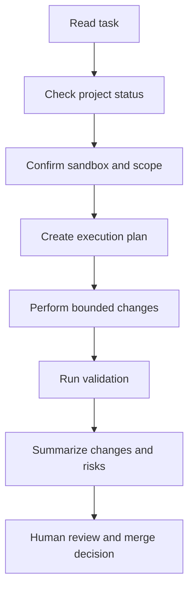

# Unreal AI Workflow

## Scope

This workflow is the project-facing wrapper around:
- [use-unrealhub](C:\Users\alain\Documents\Playground\UnrealMCPHub\skills\use-unrealhub\SKILL.md)

Use it for daily Unreal development tasks performed by an AI agent through UnrealMCPHub or RemoteMCP.

## Default Objective

Build a repeatable Unreal workflow where AI can:
- inspect the project safely
- prototype inside a sandbox
- complete bounded tasks
- produce a reviewable change summary

Do not treat this workflow as full autonomous production editing by default.

## Standard Task Loop

## Execution Steps

### 1. Read Task

Start by classifying the task:
- analysis only
- sandbox prototype
- restricted feature work
- maintenance or inspection
- benchmark

### 2. Check Project Status

Before editing, verify:
- project path is configured
- editor status is known
- active Unreal instance is correct
- required tools are available

Typical tools:
- `get_project_config`
- `hub_status`
- `discover_instances`
- `manage_instance`
- `ue_status`
- `ue_list_domains`

### 3. Confirm Sandbox And Scope

Before any write action, define:
- allowed target directory
- allowed map
- whether the task is read-only, prototype, or restricted-edit
- whether C++ edits are in scope

Default assumption:
- write only in sandbox content unless the task explicitly grants more scope

### 4. Create Execution Plan

Before edits, the agent should state:
- what it will create or modify
- where assets or code will go
- what it will not touch
- how it will verify success

### 5. Perform Bounded Changes

Preferred order:
1. read current state
2. create new assets or code in allowed paths
3. avoid destructive edits
4. keep changes small and reviewable

Use:
- `ue_call`
- `ue_run_python`
- `build_project`
- `launch_editor`

### 6. Run Validation

After each task, validate at the smallest useful level:
- blueprint compile state
- map loadability
- PIE start and stop
- relevant logs
- asset existence
- changed references if applicable

### 7. Summarize Changes And Risks

Each task should end with:
- changed files or assets
- tools used
- validation performed
- unresolved risks
- recommended next step

### 8. Human Review And Merge Decision

Required for:
- edits outside sandbox
- shared asset changes
- map changes
- project setting changes
- C++ module changes

## Suggested Working Modes

### Read-Only Mode

Use for:
- project analysis
- debugging logs
- design planning

Allowed:
- status checks
- tool listing
- reading Unreal state

### Sandbox Prototype Mode

Use for:
- new blueprints
- test widgets
- level experiments

Allowed:
- create under sandbox paths
- work in a test map
- use PIE for local validation

### Restricted Build Mode

Use for:
- one approved feature area
- one bounded directory
- one branch or task

Allowed:
- edits only inside approved module or content path
- code or asset changes tied to one task

### Benchmark Mode

Use only when:
- the environment is stable
- the sandbox process is already understood
- scoring matters more than day-to-day output

Use:
- [ue-benchmark](C:\Users\alain\Documents\Playground\UnrealMCPHub\skills\ue-benchmark\SKILL.md)

## Exit Criteria For A Successful Task

A task is complete when:
- the intended change exists in the approved scope
- validation has been run
- no forbidden area was touched
- the result is summarized in a reviewable way

If any of these are missing, treat the task as incomplete even if the feature mostly works.
